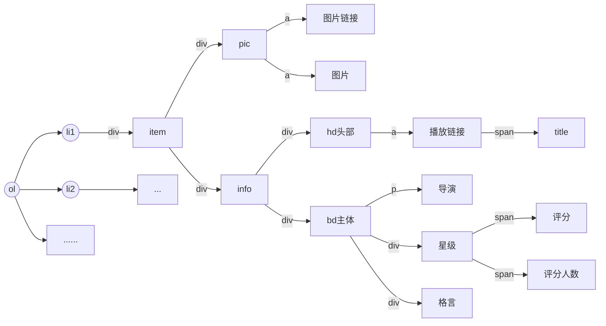

# resources

## 爬虫基础知识

### 网络请求

- 请求头
- 响应头

#### 基本信息来源

1. web网络请求（GET、POST)
2. 直播(websocket协议、一次连接、实时性)
3. app内（小红书、大众点评、微信公众号等），可使用代理工具[charles](https://www.charlesproxy.com/)抓取数据包

#### 调试工具

1. elements
2. network
3. console
4. initiator
5. xpath

#### 前端基本知识

### html、css、js

### 标签与dom




## 爬虫实现

### 用R语言实现爬虫

```R
#rvest

library(rvest)
url <- "https://book.douban.com/top250"
web <- read_html(url, encoding = "utf-8") #得url的html源码
name <- web %>% #%>%管道操作符
html_nodes(xpath = "//div[@class = 'pl2']/a") %>% 
html_text()
info <- web %>% 
html_nodes(xpath = "//p[@class = 'pl']") %>% 
html_text()
name <- gsub(" |\n", "", book_name) #把空格或\n替换为


#rcurl
library("RCurl")
library("XML")
myHttpheader <- c(
"User-Agent" = "Mozilla/5.0 (Windows; U; Windows NT 5.1; zh-CN; rv:1.9.1.6) ",
"Accept" = "text/html,application/xhtml+xml,application/xml;q = 0.9,*/*;q = 0.8",
"Accept-Language" = "en-us",
"Connection" = "keep-alive",
"Accept-Charset" = "utf-8,utf-8;q = 0.7,*;q = 0.7"
) #伪装成浏览器的请求头信息

url <- "https://book.douban.com/top250"
webpage <- getURL(url, httpheader = myHttpheader) #下载网页
pagetree <- htmlTreeParse(webpage, encoding = "utf-8", error = function(...){},
useInternalNodes = TRUE, trim = TRUE) #解析网页
node <- getNodeSet(pagetree, "//p[@class = 'pl']/text()") #定位节点（正则表达式）
info <- sapply(node, xmlValue) #xmValue函数只提取值，不提取最后的属性


```


### 用Python实现爬虫

#### 解析器

##### 正则

##### xpath

```python
from etree import lxml
```

##### Beautifulsoup

```python
from bs4 import BeautifulSoup
```

#### 抓包分析

#### js逆向

#### 自动化

- [chromedriver](https://googlechromelabs.github.io/chrome-for-testing/#stable)


## Cases

### [豆瓣top250](https://movie.douban.com/top250)


### [IMDB](https://www.imdb.com/chart/top/)


### [测试网站](https://github.com/Lifeni/crawler-test)


### [网易云音乐](https://music.163.com/)


### [链家](https://bj.lianjia.com/ershoufang/haidian/rs%E6%B5%B7%E6%B7%80/)


## Further discussion

### 异步

### 协程

### 多线程（进程）

### [scrapy](https://github.com/scrapy/scrapy)

### [分布式scrapy-redis](https://github.com/rmax/scrapy-redis)

