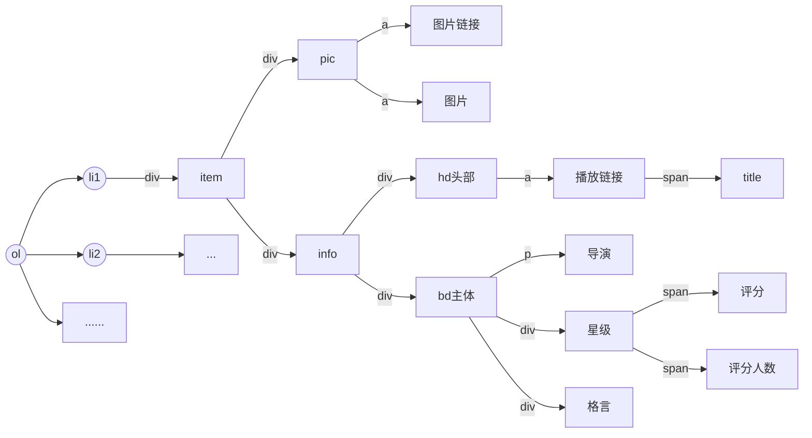
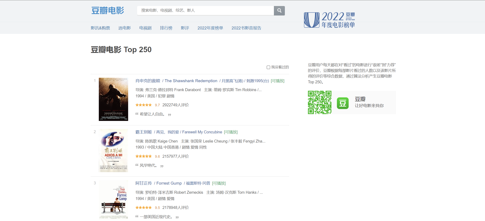
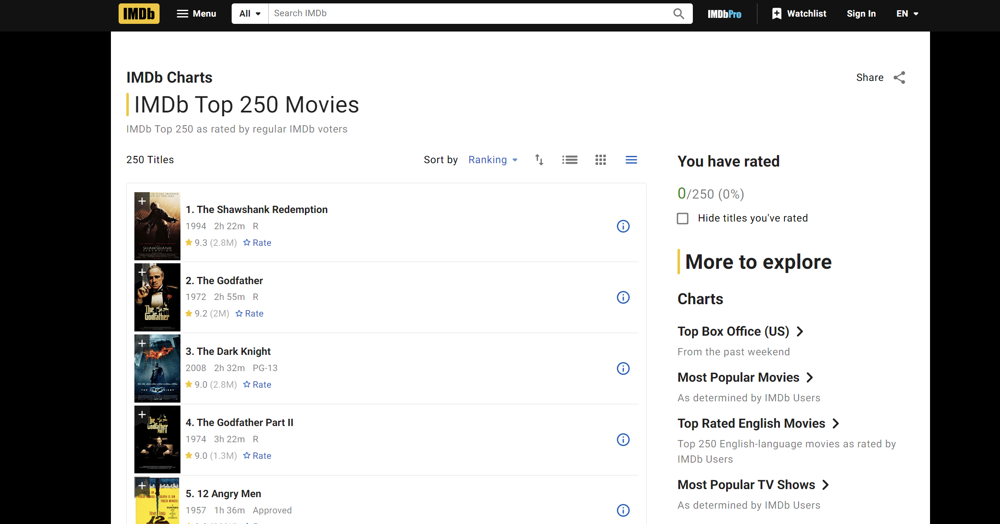
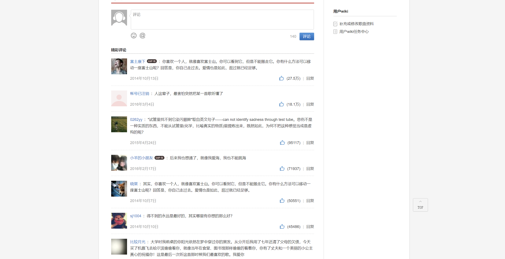
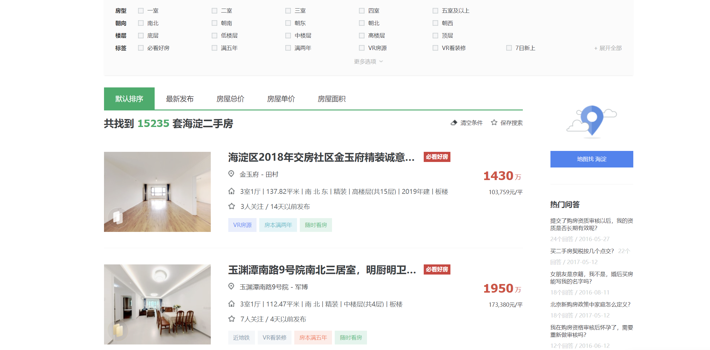

# resources

## 爬虫基础知识

### 网络请求

- 请求头
- 响应头

#### 基本信息来源

1. web网络请求（GET、POST)
2. 直播(websocket协议、一次连接、实时性)
3. app内（小红书、大众点评、微信公众号等），可使用代理工具[charles](https://www.charlesproxy.com/)抓取数据包

#### 调试工具

1. elements
2. network
3. console
4. initiator
5. xpath

#### 前端基本知识

### html、css、js

### 标签与dom




## 爬虫实现

### 用R语言实现爬虫

```R
#rvest

library(rvest)
url <- "https://book.douban.com/top250"
web <- read_html(url, encoding = "utf-8") #得url的html源码
name <- web %>% #%>%管道操作符
html_nodes(xpath = "//div[@class = 'pl2']/a") %>% 
html_text()
info <- web %>% 
html_nodes(xpath = "//p[@class = 'pl']") %>% 
html_text()
name <- gsub(" |\n", "", book_name) #把空格或\n替换为


#rcurl
library("RCurl")
library("XML")
myHttpheader <- c(
"User-Agent" = "Mozilla/5.0 (Windows; U; Windows NT 5.1; zh-CN; rv:1.9.1.6) ",
"Accept" = "text/html,application/xhtml+xml,application/xml;q = 0.9,*/*;q = 0.8",
"Accept-Language" = "en-us",
"Connection" = "keep-alive",
"Accept-Charset" = "utf-8,utf-8;q = 0.7,*;q = 0.7"
) #伪装成浏览器的请求头信息

url <- "https://book.douban.com/top250"
webpage <- getURL(url, httpheader = myHttpheader) #下载网页
pagetree <- htmlTreeParse(webpage, encoding = "utf-8", error = function(...){},
useInternalNodes = TRUE, trim = TRUE) #解析网页
node <- getNodeSet(pagetree, "//p[@class = 'pl']/text()") #定位节点（正则表达式）
info <- sapply(node, xmlValue) #xmValue函数只提取值，不提取最后的属性


```


### 用Python实现爬虫

#### 解析器

##### 正则

```python
In: re.findall(r'([\d]+)', '123abc456')
Out:['123', '456']

In:re.findall(r'([a-z]+)', '123abc456edF', re.I)
Out:['abc', 'edF']

In:
    test_str = '''123abc456edF:
    gif88'''
    re.findall(r'edF(.*)88', test_str, re.S)
Out:[':\ngif']

# 贪婪匹配
In:
    test_str = '''123abc456edF:
    gif88  edF9088'''
    re.findall(r'edF(.*)88', test_str, re.S)
Out:[':\ngif88  edF90']
    
# 非贪婪匹配
In:
    test_str = '''123abc456edF:
    gif88  edF9088'''
    re.findall(r'edF(.*？)88', test_str, re.S)
Out:[':\ngif', '90']

```


##### xpath

```python
from lxml import etree

# 寻找所有的li标签
html = etree.parse(html, etree.HTMLParser())

# 提取文本信息
html.xpath('//li/text()')
```

##### Beautifulsoup

```python
from bs4 import BeautifulSoup


res = requests.get(url).text
soup = BeautifulSoup(html, "lxml")
# 找到所有的li标签
lis = soup.find_all('li')
# 提取文本信息
for li in lis:
    print(li.get_text())
```

#### 抓包分析

目前多数数据相关网站并不采用静态加载或返回html文件，而是通过Ajax异步加载方式，一部分加载基本架构的html，一部分加载数据的json文件，如携程的旅游评论。

```python
import json
import requests
data = {
  "arg": {
    "channelType": 2,
    "collapseType": 0,
    "commentTagId": 0,
    "pageIndex": 2,
    "pageSize": 10,
    "poiId": 75595,
    "sourceType": 1,
    "sortType": 3,
    "starType": 0
  },
  "head": {
    "cid": "09031170213998177334",
    "ctok": "",
    "cver": "1.0",
    "lang": "01",
    "sid": "8888",
    "syscode": "09",
    "auth": "",
    "xsid": "",
    "extension": []
  }
}
url = "https://m.ctrip.com/restapi/soa2/13444/json/getCommentCollapseList"
res = requests.post(url, data=json.dumps(data))
print(res.json())
```

返回的json字符可直接当作dict对象处理。

#### js逆向

爬虫中最有技术难度的一部分，部分大型网站如知乎、微博等存在加密参数的反爬措施，需要通过js逆向来破解这些加密参数。

#### 自动化

使用selenium 2min上手一个小型爬虫

- [chromedriver](https://googlechromelabs.github.io/chrome-for-testing/#stable)

缺陷:selenium效率太低，并且容易被反制，一般用于简单爬虫或部分加密参数破解困难的网站，非必要时一般不使用。

## Cases

### [豆瓣top250](https://movie.douban.com/top250)



### [IMDB](https://www.imdb.com/chart/top/)



### [测试网站](https://github.com/Lifeni/crawler-test)


### [网易云音乐](https://music.163.com/)



### [链家](https://bj.lianjia.com/ershoufang/haidian/rs%E6%B5%B7%E6%B7%80/)




## Further discussion

### 异步

### 协程

### 多线程（进程）

### [scrapy](https://github.com/scrapy/scrapy)

### [分布式scrapy-redis](https://github.com/rmax/scrapy-redis)

